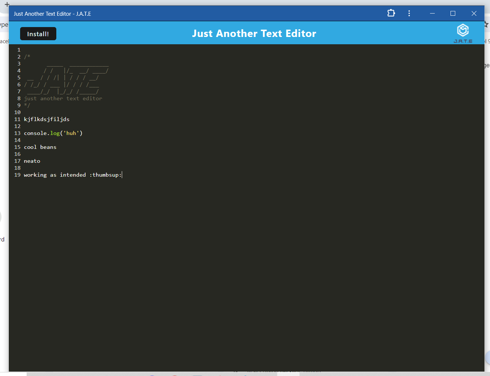

# **Module 19 Challenge:** PWA Text Editor

## Description

The goal of this project was to become a little more familiar with PWA's and to set-up the connection files for a text editor. **In addition to the files provided by the cohort, the main instructor Gary Almes provided code and comments to aid in the completion of this project. This was done with his express permission and encouragement. These notes can be seen in earlier commits and can be verified.**

The end result is a text editor app that can be accessed without internet, due to the nature of PWA's.

## Preview

The deployed project can be found at this link: [Click here for J.A.T.E](https://www.google.com)

The following screenshot provides a look at the text editor in action: 
